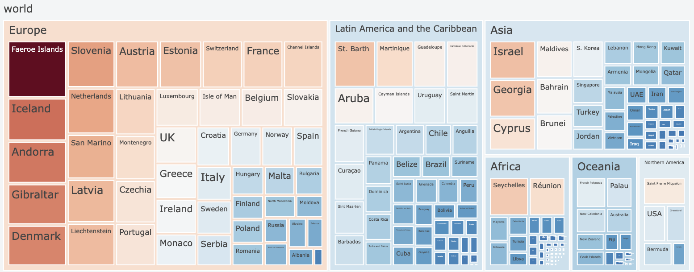

<!DOCTYPE html>

<html>
<body>
    <h1>COVID-19 Coronavirus Pandemic 🦠</h1>
    
Exploratory Data Analysis of total cases of COVID-19 around the world.

    
</body>
</html>

<!DOCTYPE html>
<html>
<body>
  <h1>About the Dataset 📋</h1>
  
This dataset provides information on the total cases of COVID-19 around the world and includes various metrics related to the pandemic. Here is an explanation of the columns in the dataset:

  
  <ul>
    <li><strong>Country</strong>: The name of the country.</li>
    <li><strong>Other names</strong>: Any alternative names for the country, if applicable.</li>
    <li><strong>ISO 3166-1 alpha-3 CODE</strong>: The three-letter country code as defined by the ISO 3166-1 standard.</li>
    <li><strong>Population</strong>: The total population of the country.</li>
    <li><strong>Continent</strong>: The name of the continent to which the country belongs.</li>
    <li><strong>Total Cases</strong>: The total number of confirmed COVID-19 cases in the country.</li>
    <li><strong>Total Deaths</strong>: The total number of deaths attributed to COVID-19 in the country.</li>
    <li><strong>Tot Cases//1M pop</strong>: The number of total COVID-19 cases per million population. This metric provides a standardized comparison of cases across countries with varying population sizes.</li>
    <li><strong>Tot Deaths/1M pop</strong>: The number of total COVID-19 deaths per million population. Similar to the previous metric, this allows for standardized comparison based on population size.</li>
    <li><strong>Death percentage</strong>: The percentage of total reported COVID-19 cases that have resulted in death. This metric gives an indication of the severity of the virus in each country.</li>
  </ul>
  
  
The dataset is sourced from RINI CHRISTY's Kaggle dataset "COVID-19 Total Cases Worldwide." You can access the dataset <a href="https://www.kaggle.com/datasets/rinichristy/covid19-coronavirus-pandemic/data">here</a>.

  

  
  
      

</body>
</html>

<html>
<body>
    <h1 style="text-align: center;">Why dataset of COVID-19 ❔ </h1>
    
We chose to perform Exploratory Data Analysis (EDA) on total COVID-19 cases around the world because it allows us to understand the global impact of the pandemic, provide valuable insights to the public, aid policymakers in decision-making, utilize the availability of COVID-19 data, and serve as an educational tool 

</body>
</html

<!DOCTYPE html>
<html>
<body>
  <h1>Why choose Treemap chart 🌳 </h1>
  
The use of a treemap visualization with COVID-19 data offers several advantages:

  
  <ul>
    <li><strong>Visualization of Hierarchical Data:</strong> A treemap is ideal for displaying hierarchical data structures, such as COVID-19 cases categorized by country, region, or population group.</li>
    <li><strong>Comparison of Magnitudes:</strong> The size of each rectangle in the treemap corresponds to the magnitude of the COVID-19 cases or related metrics, allowing for easy visual comparison between countries or regions.</li>
    <li><strong>Insight into Distribution:</strong> Treemaps can reveal patterns and distributions within the data, such as hotspots of high COVID-19 cases or regions with lower infection rates.</li>
    <li><strong>Space Efficiency:</strong> The compact layout of a treemap makes efficient use of space, enabling the display of a large amount of data in a relatively small area.</li>
    <li><strong>Interactive Exploration:</strong> Treemaps can be interactive, allowing users to hover over or click on specific rectangles to view detailed information, such as total cases, deaths, or other relevant metrics.</li>
  </ul>
  
  
With the COVID-19 pandemic being a global issue, the use of a treemap visualization provides a clear and intuitive way to understand the distribution and impact of the virus across different countries and regions. It enables policymakers, researchers, and the public to gain valuable insights into the progression of the pandemic, identify trends, and make informed decisions.

</body>
</html>

    

