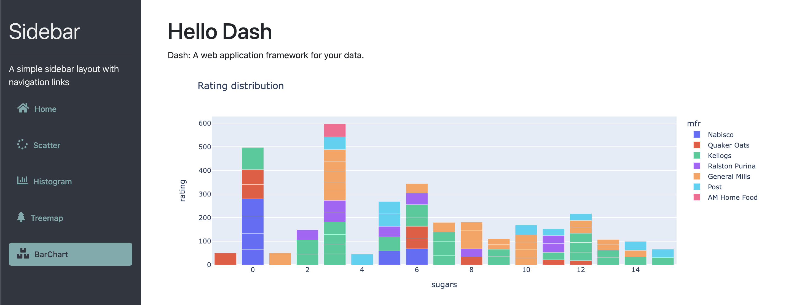
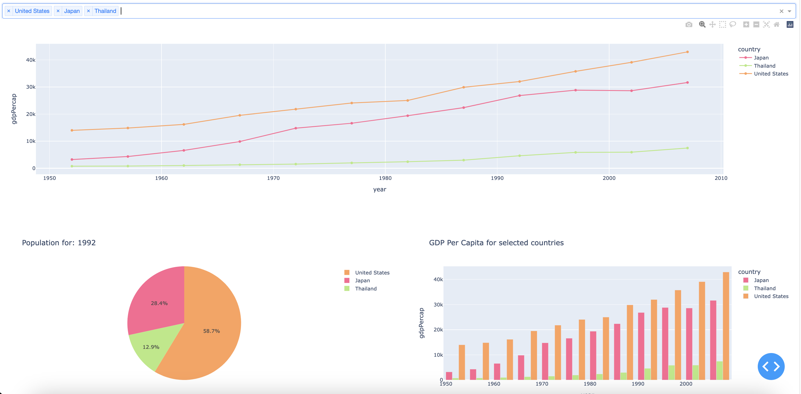

<!DOCTYPE html>

<html>
<body>
    <h1>📁 DOWLOAD SEC1 & SEC2 via Dash-6610412002.zip </h1>
    
I have compressed the files in floder sec1 & sec3 into Dash-6610412002.zip file. so that you can download conveniently.

</body>
</html>

<u><strong>Sec1</strong></u>
<li>Re-design Sec1 by using simple sidebar layout with navigation links </li>
<li>Active Box menu and adding icon </li>
       
      
       

<u><strong>Sec2</strong></u>
<li>Adding the 3rd figure (bar chart). This bar chart is updated based on the selection of the line chart.</li>
<li>Fix color bugs</li>
 
      
       

